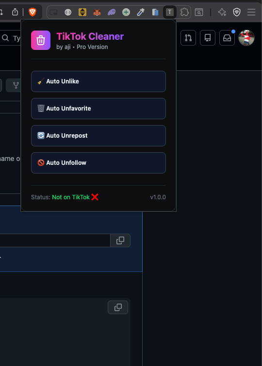
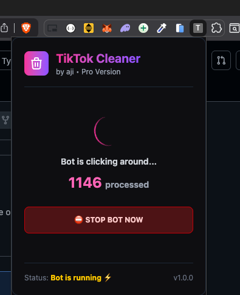

# 🧹 TikTok Cleaner Pro

A powerful and automated Chrome Extension designed to help you declutter your TikTok account by bulk-removing likes, favorites, reposts, and unfollowing users with a single click.

<p align="center">
  
  
</p>
<p align="center">
  <i>Simple interface and real-time processing with safety controls</i>
</p>

## 🚀 Features

- **❤️ Auto Unlike**: Automatically scrolls through your "Liked" tab and removes likes.
- **⭐ Auto Unfavorite**: Cleans up your "Favorites" collection seamlessly.
- **🔄 Auto Unrepost**: Quickly removes videos you've reposted.
- **🚫 Auto Unfollow**: Bulk unfollows accounts from your "Following" list.
- **🛡️ Smart Safety**: Includes built-in delays, captcha detection, and login verification to prevent account flags.
- **🌐 Universal Language**: Fully translated to English for a seamless global experience.

## 🛠️ How It Works

The bot uses advanced DOM selectors and automated navigation to strictly interact with your own profile. 
1. **Validation**: It verifies you are logged in and on your own profile before starting.
2. **Navigation**: Automatically redirects to the correct profile tab (Liked, Favorites, etc.).
3. **Execution**: Iteratively processes items with randomized delays to mimic human behavior.
4. **Safety**: Pauses automatically if a Captcha is detected.

## 📦 Installation
If you are not a developer, follow the **ZIP Method**. If you are a developer, use the **CLI Method**.

### Option 1: ZIP Method (Fastest)
1. **Download**: Download the latest release `.zip` file from this repository.
2. **Extract**: Unzip/extract the file to a folder on your computer.
3. **Chrome Extensions**: Open Chrome and type `chrome://extensions/` in the address bar.
4. **Developer Mode**: Toggle **"Developer mode"** in the top-right corner to **ON**.
5. **Load Extension**: Click the **"Load unpacked"** button in the top-left corner.
6. **Select Folder**: Select the `dist` folder you just extracted.
7. **Done!**: The TikTok Cleaner icon will appear in your extensions list.

### Option 2: CLI Method (For Developers)
1. **Clone**: Clone this repository.
2. **Setup**:
   ```bash
   yarn install
   yarn build
   ```
3. **Load**: Follow steps 3-6 from the ZIP Method above, but select the `dist` folder inside your project directory.

## 💻 Tech Stack

- **Framework**: [React](https://reactjs.org/) + [Vite](https://vitejs.dev/)
- **Language**: [TypeScript](https://www.typescriptlang.org/)
- **Styling**: Vanilla CSS / [Tailwind CSS](https://tailwindcss.com/)
- **API**: Chrome Extension API (v3)

## 🏗️ Development

If you want to modify the code:

```bash
# Install dependencies
yarn install

# Run build in watch mode (requires manual refresh of extension in Chrome)
yarn dev
# or
yarn build
```

## ⚠️ Disclaimer

This tool is for personal use only. Use it responsibly and at your own risk. Excessive automated actions on social media platforms may result in temporary restrictions on your account. The developers are not responsible for any misuse or account issues arising from the use of this software.

---
Created with ❤️ by **aji**
